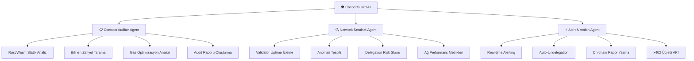

# 🛡️ CasperGuard AI — Autonomous Smart Contract Security & Network Health Agent

## Hackathon Analizi & Proje Önerisi

---

## 📊 Hackathon Özeti

| Detay | Bilgi |
|-------|-------|
| **Hackathon** | Casper Agentic Buildathon 2026 - Qualification Round |
| **Ödül** | $150,000 (nakit + ekosistem kredileri) |
| **Süre** | 1 Haziran - 31 Temmuz 2026 |
| **Platform** | DoraHacks |
| **Toplam Proje** | ~131 proje submit edilmiş |
| **Yapı** | 2 aşama: Qualification (topluluk oyu) → Final (jüri) |

### Değerlendirme Kriterleri
1. **Functionality** — Gerçekten çalışıyor mu, stabil mi?
2. **Technical Implementation** — Casper AI Toolkit kullanımı (MCP, x402)
3. **Real-World Relevance** — Gerçek bir sorunu çözüyor mu?
4. **Long-Term Launch Plans** — Hackathon sonrası sürdürülebilirlik
5. **On-Chain Activity** — Testnet'te gerçek transaction'lar göstermek (simülasyon değil!)

---

## 🔍 131 Proje Analizi — Kategori Dağılımı

### 🔴 DOYMUŞ (Oversaturated) Kategoriler — UZAK DURMALI
| Kategori | Tahmini Proje Sayısı | Neden Kötü |
|----------|---------------------|------------|
| **Trading Bot / DeFi Agent** | ~35-40 | En kalabalık kategori. "AI otomatik trade yapıyor" projesi HER YERDE |
| **Portfolio Rebalancing** | ~15-20 | Herkes autonomous portfolio agent yapıyor |
| **Due Diligence / Token Analiz** | ~10-15 | Sizin sentinel-ai gibi birçok proje var |
| **NFT Agent** | ~8-10 | NFT mint/trade agent çok tekrar |
| **Chatbot / Conversational AI** | ~8-10 | "Casper hakkında soru sor" tipi basit chatbotlar |

### 🟡 ORTA Kategoriler
| Kategori | Tahmini Proje Sayısı |
|----------|---------------------|
| **RWA (Real World Assets)** | ~8-10 |
| **Governance Agent** | ~5-8 |
| **DAO Management** | ~5-7 |
| **Yield Farming Agent** | ~5-7 |

### 🟢 AZ TEMSİL EDİLEN (Underrepresented) — FIRSAT!
| Kategori | Tahmini Proje Sayısı | Fırsat Notu |
|----------|---------------------|------------|
| **Security Audit Agent** | ~1-2 | 🎯 BÜYÜK BOŞLUK — Wasm/Rust kontrat güvenliği |
| **Validator Monitoring** | ~1-2 | Ağ sağlığı izleme çok az |
| **Compliance / RegTech** | ~0-1 | Neredeyse hiç yok |
| **Agent-to-Agent Commerce** | ~2-3 | x402'nin gerçek kullanım senaryosu |
| **Dispute Resolution** | ~0 | Tamamen boş alan |
| **Skill Marketplace** | ~0-1 | Ajanların birbirini hire etmesi |

---

## 💡 PROJE ÖNERİSİ: CasperGuard AI

### Tek Cümleyle
> **Casper ağındaki smart contract'ları otonom olarak güvenlik taramasından geçiren, validator sağlığını izleyen ve ağ anomalilerini tespit eden AI güvenlik ajanı.**

### Neden Bu Proje?

> [!IMPORTANT]
> **1. Gerçek bir sorunu çözüyor:** Casper'da Rust/Wasm kontratları için otomatik güvenlik aracı YOK. EVM'deki Slither, Mythril gibi araçlar Casper'da çalışmıyor. Bu BÜYÜK bir boşluk.
> 
> **2. Ağdaki herkese faydalı:** Hem kontrat deployer'lar hem delegatör'ler hem validator'lar kullanabilir.
> 
> **3. Casper AI Toolkit'i tam kullanıyor:** MCP, x402, CSPR.cloud, CSPR.click — hepsi entegre.
> 
> **4. Benzeri yok:** 131 projede gerçek bir security agent neredeyse hiç yok.

---

## 🏗️ Mimari & Teknik Plan

### Üç Temel Modül



---

### Modül 1: 📋 Smart Contract Auditor Agent

**Ne yapıyor?**
- Kullanıcı bir kontrat adresi veya GitHub repo linki verir
- AI agent kontratın Rust kodunu analiz eder
- Bilinen zafiyet pattern'lerini tarar (reentrancy, overflow, access control, storage manipulation)
- `cargo-audit` benzeri dependency taraması yapar
- Gas optimizasyon önerileri sunar
- Detaylı güvenlik raporu çıkarır (risk skoru, bulunan sorunlar, çözüm önerileri)

**Casper'a özel güvenlik kontrolleri:**
- Upgradeable contract güvenliği (yetkilendirme kontrolü)
- Weighted key yapılandırma analizi
- Purse yönetimi kontrolleri
- CEP-18/CEP-78 standart uyumluluğu

### Modül 2: 🔍 Network Sentinel Agent

**Ne yapıyor?**
- CSPR.cloud Streaming API ile real-time ağ izleme
- Validator performans takibi (uptime, block üretim oranı, reward geçmişi)
- Anomali tespiti (ani performans düşüşleri, şüpheli transfer pattern'leri)
- **Delegation Risk Score** — her validator için AI tabanlı risk skoru
- Ağ genelinde sağlık raporu

**Delegatörler için değer:**
- "Bu validator'a delege etmeli miyim?" sorusunu AI ile yanıtlıyor
- Validator downtime geçmişi, ödül tutarlılığı, komisyon değişiklikleri analizi
- Riskli validator tespit edilirse otomatik uyarı

### Modül 3: ⚡ Alert & Action Agent

**Ne yapıyor?**
- Risk tespit edildiğinde otomatik aksiyon
- Kritik durumlarda auto-undelegation önerisi/execution
- On-chain'e audit sonuçlarını yazma (verifiable AI output)
- x402 üzerinden ücretli API sunma (diğer agent'lar da bu servisi kullanabilir)

---

## 🔧 Casper AI Toolkit Entegrasyonu

### Kullanılacak Her Araç ve Nasıl

| Araç | Kullanım | Detay |
|------|----------|-------|
| **CSPR.cloud API** | Ağ verisi çekme | REST + Streaming API ile validator, deploy, transfer verilerini real-time çekme |
| **CSPR.cloud MCP Server** | AI → Blockchain | Agent'ın doğal dil ile blockchain sorgulaması (bakiye, kontrat state, deploy geçmişi) |
| **CSPR.trade MCP** | Piyasa verisi | Token fiyatları, likidite, DEX verileri — risk analizi için |
| **CSPR.click** | Kullanıcı auth | Wallet bağlama, social login — frontend kullanıcı onboarding |
| **x402 Facilitator** | Ücretli API | Audit sonuçlarını x402 micropayment ile satan pay-per-request API |
| **Odra Framework** | Smart contract | Audit sonuçlarını on-chain'e yazan kontrat (verifiable output) |
| **CSPR.click AI Skill** | Agent capabilities | Agent'a wallet oluşturma, transaction signing yeteneği |

### x402 Entegrasyonu — Detaylı Akış

```
AI Agent/Kullanıcı → GET /api/audit?contract=0x123
                   ← 402 Payment Required (0.5 CSPR)
                   → Payment Proof Header ile tekrar istek
                   ← 200 OK + Detaylı Audit Raporu JSON
```

**Bu sayede:**
- Diğer AI agent'lar CasperGuard'ın güvenlik servisini **otonom olarak satın alabilir**
- Agent-to-agent commerce gerçek bir use case'e dönüşür
- Proje kendi kendini finanse edebilir (sürdürülebilirlik!)

---

## 🖥️ Tech Stack

### Backend
| Bileşen | Teknoloji |
|---------|-----------|
| Runtime | Node.js / TypeScript |
| AI/LLM | OpenAI GPT-4o (veya Gemini 2.5 Pro) |
| MCP Client | @modelcontextprotocol/sdk |
| Blockchain | casper-js-sdk |
| x402 | @anthropic/x402-client (veya custom) |
| Database | SQLite (audit geçmişi) |
| Streaming | CSPR.cloud SSE |

### Frontend
| Bileşen | Teknoloji |
|---------|-----------|
| Framework | Next.js 14+ |
| Styling | Vanilla CSS (dark mode, glassmorphism) |
| Auth | CSPR.click SDK |
| Charts | Chart.js / Recharts |
| Animations | Framer Motion |

### Smart Contract (On-chain Audit Records)
| Bileşen | Teknoloji |
|---------|-----------|
| Framework | Odra (Rust) |
| Standard | Custom audit-registry contract |
| Network | Casper Testnet |

---

## 📁 Proje Yapısı

```
casperguard-ai/
├── frontend/                    # Next.js web arayüzü
│   ├── src/
│   │   ├── app/
│   │   │   ├── page.tsx         # Ana dashboard
│   │   │   ├── audit/           # Kontrat audit sayfası
│   │   │   ├── network/         # Ağ sağlığı sayfası
│   │   │   ├── validators/      # Validator analiz sayfası
│   │   │   └── api/             # API routes
│   │   ├── components/
│   │   │   ├── AuditReport.tsx
│   │   │   ├── NetworkHealth.tsx
│   │   │   ├── ValidatorCard.tsx
│   │   │   ├── RiskScore.tsx
│   │   │   └── AlertFeed.tsx
│   │   └── providers/
│   │       └── CsprClickProvider.tsx
│   └── package.json
│
├── backend/                     # Agent servisleri
│   ├── src/
│   │   ├── agents/
│   │   │   ├── auditor.ts       # Smart contract audit agent
│   │   │   ├── sentinel.ts      # Network monitoring agent
│   │   │   └── alerter.ts       # Alert & action agent
│   │   ├── mcp/
│   │   │   ├── casper-mcp.ts    # Casper MCP client
│   │   │   └── trade-mcp.ts     # CSPR.trade MCP client
│   │   ├── x402/
│   │   │   ├── server.ts        # x402 payment server
│   │   │   └── facilitator.ts   # x402 facilitator integration
│   │   ├── analysis/
│   │   │   ├── rust-analyzer.ts # Rust/Wasm kod analizi
│   │   │   ├── patterns.ts      # Bilinen zafiyet pattern'leri
│   │   │   └── risk-scorer.ts   # Risk puanlama motoru
│   │   └── services/
│   │       ├── cspr-cloud.ts    # CSPR.cloud API wrapper
│   │       ├── validator.ts     # Validator data service
│   │       └── database.ts      # SQLite audit records
│   └── package.json
│
├── contracts/                   # Odra smart contracts
│   ├── src/
│   │   └── audit_registry.rs   # On-chain audit sonuçları
│   └── Cargo.toml
│
└── README.md
```

---

## 🎨 UI/UX Tasarımı

### Ana Dashboard
- **Dark theme** — siber güvenlik teması (koyu lacivert + neon yeşil/cyan accent'ler)
- **Gerçek zamanlı ağ sağlığı göstergesi** — büyük, canlı bir "pulse" animasyonu
- **Threat Level Indicator** — yeşil/sarı/kırmızı ağ güvenlik durumu
- **Son audit sonuçları feed'i** — canlı güncellenen güvenlik raporları
- **Validator sağlık haritası** — interaktif grid/chart

### Audit Sayfası
- Kontrat adresi veya GitHub repo girişi
- Adım adım animasyonlu tarama süreci
- Sonuç: Risk skoru (0-100), kategori bazlı bulgular, çözüm önerileri
- PDF/JSON export
- On-chain kayıt butonu

### Validator Dashboard
- Tüm aktif validatorlar listesi
- Her biri için: uptime %, ödül tutarlılığı, risk skoru
- "Delege Et" / "Delegasyonu Çek" aksiyon butonları
- Trend grafikleri

---

## User Review Required

> [!WARNING]
> **Proje Değişikliği:** Mevcut `sentinel-ai` projesini bırakıp tamamen yeni bir proje (CasperGuard AI) mi oluşturalım, yoksa sentinel-ai'yi yeniden şekillendirip güvenlik odaklı hale mi getirelim?

> [!IMPORTANT]
> **LLM Seçimi:** GPT-4o mu, Gemini 2.5 Pro mu, yoksa başka bir model mi kullanalım? Maliyet ve API key durumun nasıl?

> [!IMPORTANT]  
> **Zaman Çerçevesi:** Hackathon bitiş tarihine ne kadar var? MVP'yi ne zamana kadar çıkarmamız gerekiyor?

## Open Questions

1. **x402 Facilitator:** Kendi x402 facilitator'ını mı kuralım yoksa Casper'ın sağladığını mı kullanalım?
2. **Smart Contract Deploy:** Testnet'e kontrat deploy etme konusunda hazır mısın? (Faucet'ten CSPR almışsın görüyorum)
3. **Demo Video:** DoraHacks'e submit ederken demo video gerekiyor — ekran kaydı yapabilecek misin?
4. **CSPR.cloud API Key:** API key'in var mı? Yoksa almamız lazım.

---

## Neden Bu Proje Kazanır?

| Kriter | CasperGuard AI Avantajı |
|--------|------------------------|
| **Uniqueness** | 131 projede güvenlik agent'ı neredeyse yok |
| **Real Problem** | Casper'da Rust/Wasm audit aracı gerçekten eksik |
| **Toolkit Usage** | HER aracı kullanıyor (MCP, x402, CSPR.cloud, CSPR.click, Odra) |
| **On-chain Activity** | Testnet'te gerçek deploy + audit kayıtları |
| **Sustainability** | x402 ile kendi gelirini üretiyor |
| **Agent-to-Agent** | Diğer agent'lar bu servisi satın alabilir |
| **Network Value** | Tüm ağ kullanıcılarına (developer, delegatör, validator) değer katıyor |

---

## Verification Plan

### Automated Tests
- Backend unit testleri (audit engine, risk scorer)
- MCP integration testleri
- x402 payment flow testleri
- Smart contract testleri (Odra test framework)

### On-Chain Verification
- Testnet'e audit-registry kontratı deploy
- Gerçek bir kontratı audit edip sonucu on-chain'e yazma
- x402 ile ücretli API'yi test etme

### Manual Verification
- Frontend'i localhost'ta çalıştırıp tüm akışları test etme
- Demo video kaydı
- DoraHacks'e submit
