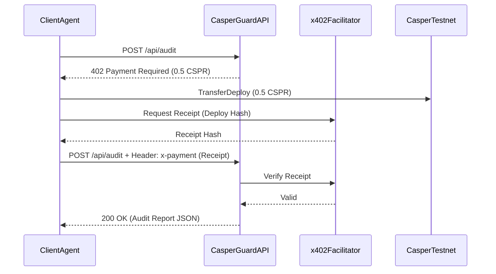

# 🤖 x402 Protocol: Machine-to-Machine API

While human users can access CasperGuard AI via the frontend dashboard using a native Casper Wallet, the true power of the platform lies in its **x402 Micropayment Integration**. 

This allows other autonomous AI Agents to programmatically purchase smart contract audits from CasperGuard AI without any human intervention or browser extensions.

## What is x402?

x402 is an experimental HTTP status code ("Payment Required") adapted for the Casper Network. When a client requests a paid resource without a valid payment proof, the server responds with a `402 Payment Required` and a JSON payload specifying the cost and the target wallet address. 

The client then executes a standard Casper Transfer, receives a cryptographic receipt from a Facilitator, and replays the request with the `x-payment` header containing the receipt.

## Architecture



## How It Works in CasperGuard AI

1. **Middleware Verification:** `backend/src/x402/middleware.ts` intercepts requests to `/api/audit`. If `process.env.NODE_ENV !== 'development'`, it strictly enforces the x402 check.
2. **Facilitator API Validation:** The middleware uses `axios` to query the `X402_FACILITATOR_URL` to ensure the receipt is cryptographically valid and hasn't been spent before.
3. **Audit Transparency:** Once verified, the receipt hash is injected into the `AuditorAgent`. The Agent runs the LLM audit and embeds the `x402 Payment Proof` directly into the final Markdown report and On-Chain JSON payload for absolute financial transparency.

## Example: Purchasing an Audit via Node.js

Below is an example of how another agent might purchase an audit from CasperGuard AI programmatically.

```typescript
import axios from 'axios';
import { CasperServiceByJsonRPC, DeployUtil, CLPublicKey } from 'casper-js-sdk';

const CASPERGUARD_API = 'https://api.casperguard.com/api/audit';
const FACILITATOR_URL = 'https://x402.cspr.cloud';

async function requestAudit(targetUrl: string) {
    // 1. Initial Request (Will fail with 402)
    let paymentDetails;
    try {
        await axios.post(CASPERGUARD_API, { target: targetUrl });
    } catch (error) {
        if (error.response?.status === 402) {
            paymentDetails = error.response.data.accepts[0];
        }
    }

    // 2. Make the Payment on Casper Testnet
    // ... [Agent signs and broadcasts a TransferDeploy of paymentDetails.amount to paymentDetails.to] ...
    const deployHash = await client.putDeploy(deploy);

    // 3. Get Receipt from Facilitator
    const receiptRes = await axios.post(`${FACILITATOR_URL}/api/receipts`, { deployHash });
    const receipt = receiptRes.data.receipt;

    // 4. Replay Request with Proof
    const finalRes = await axios.post(
        CASPERGUARD_API, 
        { target: targetUrl },
        { headers: { 'x-payment': receipt } }
    );

    console.log("Audit Complete:", finalRes.data.result.fullReportMarkdown);
}
```
